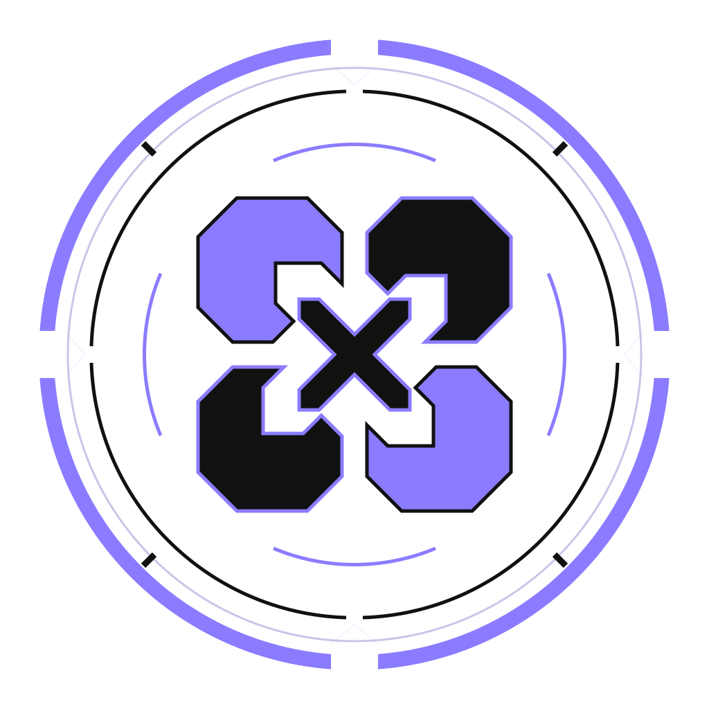

<h1 align="center">
  <picture>
    <source media="(prefers-color-scheme: dark)" srcset="public/xiriacanvas-wordmark-dark.svg">
    <source media="(prefers-color-scheme: light)" srcset="public/xiriacanvas-wordmark-light.svg">
    
  </picture>
</h1>

<p align="center">
  
</p>

<p align="center">
  <strong>English</strong> · <a href="README.zh-CN.md">简体中文</a>
</p>

XiriaCanvas AI is a local image-generation UI for Stable Diffusion, Illustrious,
and the native Anima, FLUX.1, FLUX.2, and Krea 2 engines. The same source tree
supports Windows and Linux. The project does not depend on ComfyUI or Stable
Diffusion WebUI at runtime.

## Engines

Six engines are selectable in Generate. They share one prompt grammar, one
sampler vocabulary, and one gallery, and differ in how a model is assembled and
how guidance is applied.

| Engine | Model | Components |
| --- | --- | --- |
| **SD** | Stable Diffusion | one checkpoint |
| **iL** | Illustrious / SDXL | one checkpoint |
| **Anima** | native Flow Matching | diffusion model + text encoder + VAE |
| **Flux** | FLUX.1, distilled guidance | diffusion model + CLIP-L + T5-XXL + VAE |
| **Flux2** | FLUX.2, large-model guidance | diffusion model + text encoder + VAE |
| **Krea2** | Krea 2 single-stream DiT | diffusion model + text encoder + VAE |

SD and iL mount one checkpoint file. The four native engines mount their parts
separately, so a text encoder or VAE can be shared between models instead of
being duplicated inside every checkpoint. FLUX.1 is the only engine that takes
two text encoders.

Both FLUX generations are guidance distilled: they have no unconditional branch,
so the negative prompt carries nothing and is not sent. What you typed stays in
the box for the other engines. Krea 2 is the one native engine that is not
distilled and keeps a working negative prompt.

Guidance support follows the same split. PAG is available for SD, iL, and native
Anima; CFG-Zero* is available for native Anima and Krea 2. Neither applies to
either FLUX generation.

## Requirements

- Windows 10/11 or a modern x86-64 Linux distribution.
- Node.js 22.21 or newer.
- Python 3.10 through 3.13, or `uv` for automatic Python 3.12 installation.
- An NVIDIA GPU and a current NVIDIA driver for image generation.

PyTorch wheels include their own CUDA runtime. A system-wide CUDA Toolkit is not
required and, if present, its version is deliberately ignored. Existing global
or project PyTorch installations also do not influence automatic selection.
The setup script detects the NVIDIA GPU and the maximum CUDA ABI supported by
its driver, then queries the current official wheel indexes and selects the
newest stable PyTorch release with the newest bundled CUDA runtime that remains
within that driver ceiling. It downloads exactly that one combination and then
runs one real CUDA tensor operation; it does not download multiple large wheels
to trial different versions. It does not install or modify system GPU drivers.

## Setup

The easiest setup opens a local visual configuration window. The wizard first
detects your GPU and queries the official PyTorch wheel catalog without
installing anything. You can then choose:

- **Auto setup** — selects the newest stable PyTorch with the highest
  driver-compatible bundled CUDA runtime in one pass.
- **Manual setup** — pick a CUDA runtime and a specific PyTorch version from the
  wheel catalog. Versions that are older than the current latest stable release
  or use a non-preferred CUDA runtime are marked **Non-recommended** with a
  reason. The setup downloads exactly the chosen combination.

Both modes include an xformers toggle (on by default). Manual mode can also
enable **auto-repair**: if the installed PyTorch/CUDA combination fails the
post-install CUDA tensor operation, the setup automatically tries the next-best
compatible combination without re-opening the wizard.

**Network policy:** setup, its visual wizard, direct/Range downloads, and the
`uv`, `pip`, and `npm` child installers use a direct connection by default.
They clear inherited HTTP(S)/ALL proxy variables and npm/pip/uv proxy settings
only in their own process environment; they never modify system, VPN, shell, or
user-level tool configuration. `NO_PROXY` remains unchanged. To deliberately
use an already configured proxy, pass `--use-proxy` (for example
`npm run setup:cli -- --use-proxy`) or set `XIRAI_USE_PROXY=1`. An opted-in
proxy that is unavailable is reported as an error; setup never silently retries
that request directly. The visual wizard clearly starts in **direct by default**
mode and also accepts `npm run setup -- --use-proxy`. This is application-level
HTTP(S) control only: it cannot change operating-system routing or a full-tunnel
VPN, which still carry the traffic whatever setup chooses.

**Windows:** double-click `Setup-XirAI.bat`.

**Linux:** run `sh Setup-XirAI.sh`, or mark `XirAI-Setup.desktop` as trusted and
double-click it. Both launchers locate the project from their own file location,
so spaces and non-English characters in the installation path are supported.

The same one-line command works on Windows and Linux:

```text
npm run setup
```

The configuration window is always served at `/config`:

```text
http://localhost:7709/config
http://YOUR-LAN-IP:7709/config
```

Before setup and build verification finish, `/` and all main application APIs
are locked. Opening `http://localhost:7709/` or `http://YOUR-LAN-IP:7709/`
redirects to `/config`. The inference backend is not started while locked.

The window shows the XirAI logo, machine detection, selected Python/PyTorch/CUDA
versions, the complete download plan, per-file MB/total download progress,
completed downloads/total downloads, live logs, and final build verification.
When it reports that configuration and build passed, click **Restart and enter
the main page**. The configuration server releases port 7709, starts the main
service on the same port, waits for it to become ready, and automatically opens
the main application.

After setup, the normal start command is:

```text
npm start
```

Windows users can double-click `Start-XirAI.bat`. Linux users can run
`sh Start-XirAI.sh`, or mark `XirAI-Start.desktop` as trusted and double-click
it. The start launcher never installs or changes the environment. If the setup
marker, Python environment, Python dependencies, Node dependencies, or build
tools are missing, it exits with **Please configure the environment first** and
points to `Setup-XirAI`.

## Model Downloader

The model downloader keeps one serial queue for pasted links and recommended
model selections. While one file is downloading, you can continue adding links,
open the recommended-model browser, and append more selections without
interrupting the active transfer. Recommended artifacts that already pass their
catalog size and SHA-256 checks, or are already present in the queue, are omitted
from the waiting list.

Native Anima's Qwen3 tokenizer, tokenizer config and T5 tokenizer JSON files are
bundled under `backend/resources/anima-tokenizers`. Users only download the
selected Anima DiT, text encoder and VAE; setup, startup and program updates
validate the bundled tokenizer bytes automatically.

Failed rows can be retried from the downloader page. Retry keeps the original
segment count and reuses retained `.part`/`.part.N` files, so available bytes
continue from their saved offsets. Provider tokens remain browser-local and are
resubmitted for retry; they are never written to the persisted queue state.

**Settings → About → Online program update** checks the release feed for a
newer version. Nothing is downloaded by the check itself: when a newer release
exists the version, size, publication date and release notes are shown and the
update starts only after you confirm it. The archive is then verified and
applied by the updater described below, with the same rollback, so the online
and offline routes differ only in how the archive reaches the machine.

Accelerated mirrors are used only after the release publishes both the exact
`XirAI-<version>.7z` archive and its exact uploaded
`XirAI-<version>.7z.sha256` sidecar. The sidecar is fetched and strictly
validated before any archive route is enabled, and an API digest is
cross-checked when present. Missing, malformed, ambiguous, draft, prerelease,
or incorrectly named releases fail closed instead of being presented as an
available update. The feed, repository, mirror and optional token are
configurable in `.env`; see `.env.example`.

Publishing a release is intentionally strict: push a tag matching
`vMAJOR.MINOR.PATCH` and the exact `package.json` and lockfile version. The
Release workflow creates `XirAI-<version>.7z` and its matching `.sha256` asset,
validates the allowlisted package, and tests the update against the previous
stable release when one exists. The initial `v1.0.0` release uses an isolated
first-release validation. A repository with no published release yet reads as
"already up to date" rather than as an error.

The **Settings → About → Manual program update** page accepts trusted clean
XiriaCanvas AI project archives such as ZIP, 7Z, RAR, TAR, TAR.GZ, and TAR.XZ.
Archives are inspected and extracted with command-line tools into a temporary
directory outside the project. When system commands cannot read the archive,
the updater downloads checksum-pinned official 7-Zip command files for the
current Windows or Linux architecture to `.cache/tools/7zip/`; it never runs an
installer or uses desktop file associations.

An update must carry the same Node dependencies as the installed environment.
An archive that changes them is refused rather than applied, because replacing
`node_modules` under a running process is not safe on Windows; such a version is
delivered as a full package to install fresh. A changed
`backend/requirements.txt` is supported: the files are replaced and the Python
environment is then repaired automatically.

Only program files are replaced. `.venv`, `node_modules`, `models`, `outputs`,
`logs`, `state-cache`, `.cache`, `.env`, and installed `plugins` remain in
place, as does your own `models/model-paths.json`. Before replacement, managed
files are backed up outside the project. Copy failures, Python validation
failures, and production build failures are rolled back automatically.

The setup script:

1. Detects Windows or Linux and finds Python using native platform conventions.
2. Creates `.venv` with Python 3.10-3.13.
3. When Python is absent, installs a tested, pinned `uv` release under the
   project cache using mandatory per-platform SHA-256 hashes, then installs
   managed Python 3.12 under the same cache.
4. Detects the NVIDIA GPU and driver compatibility ceiling using both
   `nvidia-smi` (including newer `CUDA UMD Version` output) and the CUDA Driver
   API. This is not detection of an installed CUDA Toolkit.
5. Benchmarks the actual target package on the official, Aliyun, and Tsinghua
   routes before each download item, then automatically fails over if that
   route becomes unavailable.
6. Resolves the newest stable PyTorch release that has a wheel for the current
   operating system, Python version, architecture, GPU, and driver. PyTorch
   version is prioritized first; among wheels for that release, the newest
   driver-compatible bundled CUDA runtime is selected.
7. Downloads large PyTorch wheels with up to 8 verified HTTP Range segments.
   Other Python wheels use `uv` package-level concurrency, then everything is
   installed inside this repository's isolated `.venv`.
8. Installs `xformers` by default when a compatible wheel exists. An
   incompatible wheel is safely removed without replacing the selected Torch.
9. Verifies the exact PyTorch/CUDA versions, runs a real CUDA tensor operation,
   checks dependency consistency, and runs the production frontend build.

If setup is interrupted, **Continue setup from checkpoint** reuses the cached
driver/PyTorch/CUDA-runtime selection and wheel metadata, skips completed and verified
installation steps, and avoids querying the version indexes again. Large files
in `.cache/downloads` resume each incomplete Range segment from its saved byte
offset; Python packages in the local `uv` cache and npm's package cache are also
reused automatically. Recreating `.venv` or changing a dependency manifest
invalidates only the affected checkpoints. Use `--refresh-selection` only when
CUDA/PyTorch should be selected again.

Package-source overrides:

```text
npm run setup:cli -- --source=official
npm run setup:cli -- --source=aliyun
npm run setup:cli -- --source=tsinghua
npm run setup:cli -- --torch=cu126
npm run setup:cli -- --torch=cu126 --torch-version=2.13.0+cu126
npm run setup:cli -- --torch=cpu
npm run setup:cli -- --diagnose
npm run setup:cli -- --without-xformers
npm run setup:cli -- --connections=12
npm run setup:cli -- --refresh-selection
npm run setup:cli -- --use-proxy
```

CUDA runtime variants are discovered dynamically from the current stable
PyTorch wheel indexes; the script has no fixed maximum CUDA version. An NVIDIA
machine never silently falls back to a CPU wheel if detection or compatibility
selection fails. GPU hardware generation alone is not treated as permission to
exceed the currently installed driver's reported compatibility ceiling. For
example, a GPU capable of running a CUDA 12.8 build still receives `cu126` when
its current driver reports a 12.6 ceiling. `--torch=cpu` remains an explicit
diagnostic override.
`xformers` is installed
by default without dependencies, so it cannot replace the exact selected
PyTorch version. It is removed automatically if the import compatibility check
fails. Advanced users can disable it with `--without-xformers`.

The same options can be configured with `XIRAI_PACKAGE_SOURCE`,
`XIRAI_TORCH_VARIANT`, `XIRAI_TORCH_INDEX`,
`XIRAI_DOWNLOAD_CONNECTIONS` (1-16), and
`XIRAI_PACKAGE_CONCURRENCY` (1-32). Automatic routing is the default. An
explicit `--source` keeps that source first and uses the official source only
as a failure fallback.

The project-local uv bootstrap reproduces the security-relevant behavior of
the official Bash/PowerShell installer without executing a downloaded script.
It selects the Windows `.zip` or Linux `.tar.*` artifact, checks the official
minimum glibc version and falls back to the static musl build, downloads from
the Astral release route with GitHub fallback, verifies a pinned SHA-256, tests
the exact uv version in a staging directory, and atomically promotes it to
`.cache/tools/uv/current`. The extracted `uvx` and Windows `uvw.exe` binaries
are preserved.

The default uv target-file benchmark also includes `ghfast.top` and
`ghproxy.net` acceleration routes before the Astral and GitHub fallbacks. They
are treated only as untrusted byte transports: every completed archive must
match the embedded official SHA-256 or it is deleted. Since the Windows uv
archive is about 25 MB, uv uses a dedicated 8 MB threshold and therefore runs
up to 8 HTTP Range connections instead of falling back to one connection.

Advanced mirrors can use the official installer variables `UV_DOWNLOAD_URL`,
`INSTALLER_DOWNLOAD_URL`, `UV_INSTALLER_GHE_BASE_URL`, or
`UV_INSTALLER_GITHUB_BASE_URL`; each is a base URL and the archive filename is
appended automatically. Multiple direct bases can be whitespace-separated.
`UV_GITHUB_TOKEN` is forwarded only to GitHub or the explicitly configured
GitHub Enterprise host. Artifact hashes remain mandatory for every mirror.
Setting any of these source variables replaces the built-in accelerated route
list, so an official-only or private mirror policy remains available.
Bootstrap requests use the same direct-by-default policy. `HTTP_PROXY`,
`HTTPS_PROXY`, and `ALL_PROXY` (including lowercase forms) are honored only
after explicit `--use-proxy` or `XIRAI_USE_PROXY=1`; `NO_PROXY` remains intact.

Unlike a user-level uv installation, XirAI deliberately ignores installation
directory and PATH mutation settings: it never modifies shell profiles, the
Windows registry, `PATH`, Cargo/XDG directories, or a user-level uv receipt,
and does not enable `uv self update`. The application always invokes its pinned
project-local executable directly.

Setup never installs into system Python, modifies a global pip configuration,
installs a CUDA Toolkit, or changes an NVIDIA driver. Runtime only uses the
canonical project `.venv`; Python and pip redirection variables are removed.
An old non-isolated `.venv` is preserved as `.venv.backup-<timestamp>` before a
new environment is created. ComfyUI, SD WebUI, and their environments are not
read, imported, upgraded, or modified.

## Configuration

Copy `.env.example` to `.env` only when defaults need to be changed. Relative
paths are resolved from the repository root on both operating systems.

The default services are:

- Configuration and Web UI: `0.0.0.0:7709`
- Inference backend: `127.0.0.1:8718`

The Web UI is available at both `http://localhost:7709/` and
`http://YOUR-LAN-IP:7709/`. Only the Web UI is exposed to the LAN; the Python
inference service remains loopback-only and is accessed through the Web proxy.

Use the LAN address only on a trusted network. It exposes the development UI
and proxied local inference APIs to devices that can reach port 7709.

## Prompt weights and guidance

All six engines share the core ComfyUI parenthesis grammar:

- `(text)` applies the default `1.1` emphasis.
- `((text))` multiplies nested emphasis.
- `(text:1.25)` applies an explicit finite weight.
- `\(text\)` keeps literal parentheses.

Square-bracket de-emphasis, `BREAK`, textual-inversion tags, Prompt LoRA tags,
and A1111 scheduling syntax are not interpreted by this grammar. Anima parses
Qwen and T5 token boundaries independently and applies weights to the
T5-aligned LLM-adapter output.

PAG is available for SD, iL, and native Anima with scale `0..5` and `mid|all`
scope. Anima uses a native Cosmos identity-self-attention branch rather than a
Diffusers UNet adapter. It runs branches sequentially to keep one physical
transformer forward live at a time and propagates the same settings into native
Hires and ADetailer refinement. CFG-Zero* covers native Anima and Krea 2. Both
FLUX generations are guidance distilled and take neither.

Native Anima adapter fusion accepts standard LoRA, static full-rank T-LoRA,
linear LoHa, supported linear LoKr forms, and output-axis LyCORIS linear DoRA
using `dora_scale`. Supported linear LoKr may also carry output-axis
`dora_scale`. Weight zero is an exact disable. Tucker/convolution forms,
decomposed LoKr first factors, PEFT `lora_magnitude_vector`, and
`lora_mid.weight` fail closed.

All four native engines offer the same 44 sampler and nine scheduler names in
Generate and Gallery. The vocabulary is shared; the schedules behind it are not.
Anima's nine are native Flow-shift-3 trajectories. Both FLUX generations and
Krea 2 run the same ModelSamplingFlux table, FLUX.2 taking its shift from the
model and Krea 2 from the static shift its own model config declares. Named
compatibility solver mappings are reported in task warnings and PNG sampling
metadata rather than silently pretending to be a different implementation.

## Image batches

Sampling parameters include two independent output controls:

- **Images per batch** accepts 1-10. One Diffusers pipeline call uses
  `num_images_per_prompt` and an equal-length generator list, so all images in
  that batch are sampled together rather than as sequential single-image jobs.
- **Batch count** accepts 1-20. Batches are queued inside one controllable job
  and run in order. For example, 3 images x 4 batches performs four pipeline
  calls and saves 12 images. The maximum task size is 10 images x 20 batches,
  or 200 saved images.

Seeds increase by output position across the complete job and wrap safely in
the unsigned 64-bit range. The result browser groups outputs by batch and lets
the user select any image in the active batch. Zoom and download actions always
use the selected image. Cancelling or failing a multi-batch job removes partial
outputs, while completed PNG files include their batch, image, seed, and total
batch settings in metadata.

## Image viewer workspace

The local image workspace can be opened from the preview header or its empty
state before any image has been generated. The upper-right **全屏** button expands
the workspace to the browser window without using F11. The optional left image
rail defaults to PNG/GIF files created since the current Web UI session started.
Its explorer strip can open the configured output root, enter arbitrary nested
folders, and return one level at a time. Each level displays direct child folders
and direct images together, so a folder may contain both. Single-image batches
appear as individual cards. Multi-image batches are grouped into one card with a
count badge; opening that card reveals its images and a return button restores
the previous card scroll position.

History cards can be left-clicked to switch the active preview, dragged into the
workspace, or right-clicked to add a new layer and manage deletion. Deletion
offers a preview-only hide or permanent removal of the corresponding PNG source
files. Layers can be moved, resized from their corner handles, and independently
scaled with the toolbar or Ctrl + mouse wheel. Grid snapping is optional and the
grid cell size is editable in pixels.

The workspace also includes three recommended layouts for each image count from
2 through 9: horizontal comparison, a regular grid, and a feature-image layout.
Template cells accept images dragged from the history rail or existing workspace
layers. Confirming a filled template creates a lossless PNG composition in the
browser; the result can be edited again, copied without PNG generation metadata,
deleted without saving, or saved to the current date directory under `outputs`.

The workspace defaults to a 16 px grid. Grid and image-edge snapping are
separate: edge snapping detects the visible bounds of nearby freeform image
layers, shows alignment guides, and snaps their edges together when released.
An optional edge-line panel can draw solid, dashed, dotted, double, or glow
lines around snapped images and template cells. It supports a standard color
palette, the browser's screen color picker when available, and editable line
width. Template layouts react to image aspect ratios, and each selected cell
supports image scale plus left/center/right and top/middle/bottom alignment.
For a manually arranged group, **一键拼图** creates one lossless composite from
the current visible layout. Changing edge-line settings on an unsaved completed
collage restores its editable form and requires confirming it again.

Runtime paths can be moved outside a read-only checkout:

```text
XIRAI_CACHE_DIR=.cache
XIRAI_OUTPUT_DIR=outputs/my-project
```

Runtime VRAM management defaults to `XIRAI_MEMORY_MODE=auto` and follows the
memory-budgeting behavior of ComfyUI without importing or depending on ComfyUI.
Before the first checkpoint load, XirAI measures current free/total VRAM,
estimates the checkpoint's FP16 runtime weight size from its safetensors tensor
metadata, accounts for the requested canvas, reserves at least 0.8 GB for
inference, and keeps the same OS headroom as ComfyUI (600 MB on Windows, plus
100 MB on GPUs over 15 GB; 400 MB elsewhere).

- `HIGH_VRAM` is selected only when the complete pipeline and inference
  workspace fit. It keeps all model components on CUDA and enables the fastest
  CUDA/TF32/cuDNN path.
- `NORMAL_VRAM` uses component-level dynamic CPU/GPU scheduling. The denoiser
  stays on the GPU throughout its sampling loop, while inactive components are
  moved as required. Native Anima on an eligible 8 GB budget keeps the complete
  Cosmos Transformer resident during sampling for high utilization.
- `LOW_VRAM` uses sequential layer offload plus VAE slicing and tiling for GPUs
  that cannot safely hold the largest component and inference workspace. Native
  Anima uses synchronous one-block Cosmos group offload and serial image
  microbatches where required.

If Anima's resident Transformer path encounters a real CUDA OOM, XirAI restores
the CPU generator state and automatically replays that sampling chunk with
one-block group offload. This keeps auto mode speed-first without turning a
tight-VRAM machine into a failed job or changing its Seed trajectory.

All three modes keep the loaded pipeline object cached after a successful,
cancelled, or non-OOM failed generation, so another generation with the same
engine and model identity does not read and reconstruct the model again. For
native Anima, that identity includes the diffusion model, text encoder, VAE,
fixed tokenizer revisions, and ordered nonzero adapter revisions/weights. The
cache is released when the engine/model selection changes, CUDA
reports an out-of-memory error, an interrupted offload chain cannot be safely
restored, or the inference service shuts down. SD/iL LoRA changes do not reload
the base model; native Anima adapters are densely fused into its composite
runtime identity. PyTorch SDPA is used automatically when available, with xformers
preferred when its compatible native extension is installed.

Advanced users may force `high_vram`, `normal_vram`, or `low_vram` with
`XIRAI_MEMORY_MODE`; an unsafe forced mode automatically downgrades. Set
`XIRAI_RESERVE_VRAM_GB` to override the default OS/application reserve.

The output value may use a custom folder name or any nested relative path. An
absolute local value is also accepted in `.env`; no absolute user or system path
is committed to the repository. Blank output paths are rejected.

## Models

See `models/README.md`. Model configuration in `models/model-paths.json` uses
project-relative paths below `models` and works unchanged on Windows and Linux.
Every root may use custom names and arbitrary nesting. Checkpoints, LoRAs,
upscalers, YOLO detectors, and compatible background-removal models are scanned
recursively.

A program update keeps your own `models/model-paths.json` instead of replacing
it, so custom model roots survive an upgrade. Keys you leave out fall back to
the built-in defaults, which is why a file written for an older version stays
correct. Only a missing file, or one the updated project could not use, is
restored from the release. The recommended-model, YOLO, and background-removal
catalogs are refreshed by every update, since those are the lists the program
ships rather than your configuration.

The recommended-model browser covers, in addition to any file you place in
`models` yourself:

- **Illustrious** — WAI Illustrious SDXL, MiaoMiao Harem, and Obsession
  Illustrious XL, each tracking its Civitai version list.
- **Anima** — the official CircleStone Labs releases from both Civitai and the
  Hugging Face `split_files` tree, paired automatically with the shared Qwen
  0.6B text encoder and Qwen Image VAE.
- **FLUX.2** — Klein 9B True V3 as Safetensors or GGUF, and the official
  Klein 9B KV single-file build, which is gated and needs an accepted repository
  licence and a Hugging Face token. Both pair with a Qwen 3 8B text encoder and
  the FLUX.2 VAE.
- **Krea 2** — the 12B model in Raw and Turbo variants, with a separately chosen
  4B text encoder precision. Its VAE is shared with Anima.
- **Upscalers** — the official Real-ESRGAN models used by the first Hires.fix
  stage.

Quantized variants are offered where the publisher ships them, so the same model
can be taken at bf16, fp8, mxfp8, nvfp4, int4/int8, or GGUF Q4-Q8 to match the
available VRAM. FLUX.1 has no recommended family: it runs from diffusion model,
CLIP-L, T5-XXL, and VAE files you supply yourself.

## Development

```text
npm ci
npm run dev
npm run test:backend
npm run build
npm run inference
```

Do not copy `node_modules` or `.venv` between operating systems. Recreate both
with `npm run setup` on the target machine.

GitHub Actions runs lightweight cross-platform checks on both `windows-latest`
and `ubuntu-latest` for every push and pull request: Node installation and
diagnostics, fast Node tests, Node/Python syntax checks, and the Vite build. It
does not create a project virtual environment, install CPU PyTorch or backend
requirements, or run backend tests. Run the complete backend suite and real GPU
validation locally.

To validate a real clean environment without downloading its dependencies on
your local connection, open **Actions → Environment setup validation → Run
workflow**. Choose `both`, `windows`, or `ubuntu`, then choose the allowed
package source (`official`, `aliyun`, or `tsinghua`). This manual GitHub-hosted
workflow runs `setup:cli` with CPU PyTorch and `--without-xformers`, verifies
the project `.venv`, performs a minimal backend import/compile smoke test, and
builds Vite. It does not download model weights or run the complete backend
behavior suite, but it does consume GitHub Actions minutes and download budget.
